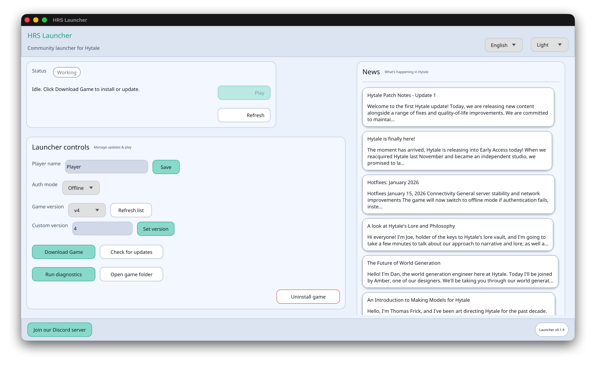

# HRS Launcher

A community launcher for Hytale with integrated diagnostics and mod downloads.

- Join Discord: https://discord.gg/2ssYjNRXZ

## Features

- Launch Hytale
- Integrated diagnostics
- Multi-platform support (Windows, Linux, macOS)
- Multi-language support: English, Ukrainian, Spanish, French, German, Portuguese, Chinese, Hindi, Russian, Turkish
- Mod management and downloads
- JVM options optimized based on system specs

## Download

Check out the latest releases on GitHub: https://github.com/RustedBytes/hrs-launcher/releases

## Screenshots

### macOS



## Building

This project is written in Rust. To build the launcher:

```bash
cargo build --release
```

The compiled binary will be available in `target/release/hrs-launcher` (or `hrs-launcher.exe` on Windows).

## Usage

Run the launcher:

```bash
cargo run --release
```

Or run the compiled binary directly from `target/release/`.

### Command-line Options

- `--version-only` - Print launcher version and exit without starting the UI

## Requirements

- Rust toolchain (edition 2024)
- Dependencies are managed automatically by Cargo

## Debug

```
ulimit -c unlimited

gdb --batch -ex run -ex 'bt' -ex 'thread apply all bt' --args \
  ~/.local/share/hrs-launcher/release/package/game/latest/Client/HytaleClient \
  --app-dir ~/.local/share/hrs-launcher/release/package/game/latest \
  --user-dir ~/.local/share/hrs-launcher/UserData \
  --java-exec ~/.local/share/hrs-launcher/jre/bin/java \
  --auth-mode offline --uuid 00000000-1337-1337-1337-000000000000 --name Player
```

## Troubleshooting

### `free(): invalid pointer` on Ubuntu

```
sudo apt update && sudo apt install libzstd1

find /usr/lib -name "libzstd.so*" 

ln -s /usr/lib/x86_64-linux-gnu/libzstd.so.1 ~/.local/share/hrs-launcher/release/package/game/latest/Client/libzstd.so 
```

## Acknowledgements

- https://github.com/yyyumeniku/HyPrism

## Disclaimer & Legal

HRS Launcher is a third-party, community-driven project.

- We are not affiliated with, endorsed by, or associated with Hypixel Studios or Riot Games.
- "Hytale" is a trademark of Hypixel Studios.
- This software is provided "as is" for educational and interoperability purposes. Users are encouraged to support the official developers by purchasing the game.

## TODO

- [x] Add a button to open Game folder
- [x] Increase height of textarea field for Diagnostics
- [x] Cancel button does not work for JRE downloading
- [x] Save selected game version between restarts
- [x] Move the Play button to Status block
- [x] Move Launcher version to the bottom of the window
- [x] Show results of diagnostics in a modal window
- [x] Improve mod management features
  - [x] Show installed mods
  - [x] A feature to remove installed mod
- [x] When game is downloaded, Play button should be enabled
- [x] Add more languages
- [x] Direct mod installation
- [ ] Eliminate dead code in the project
- [ ] Add online mode

If you need a feature, create an issue in our issue tracker: https://github.com/RustedBytes/hrs-launcher/issues
