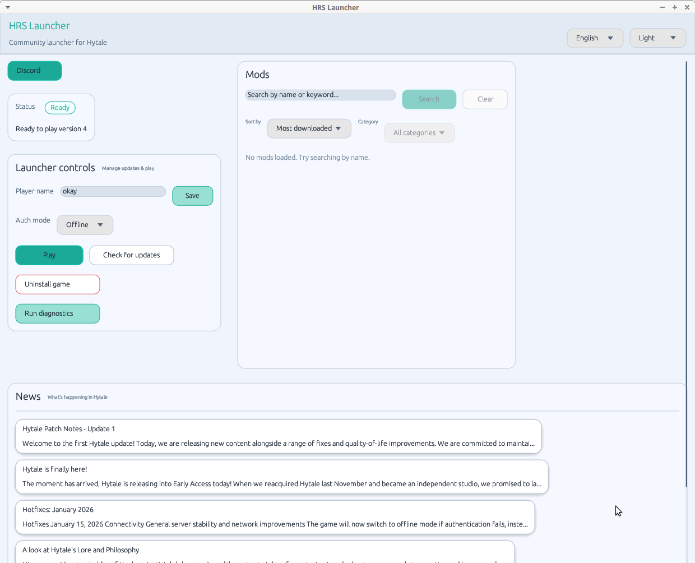

# HRS Launcher

A community launcher for Hytale with integrated diagnostics and mod downloads.

- Join Discord: https://discord.gg/2ssYjNRXZ

## Features

- Launch Hytale
- Integrated diagnostics
- Multi-platform support (Windows, Linux, macOS)
- Multi-language support: English and Ukrainian yet
- Mod management and downloads
- JVM options optimized based on system specs

## Download

### v0.1.0

- Windows: [hrs-launcher-windows-v0.1.0.zip](https://github.com/RustedBytes/hrs-launcher/releases/download/v0.1.0/hrs-launcher-windows-v0.1.0.zip) - [virustotal](https://www.virustotal.com/gui/file/c63facfec344011f62a1a9eb85ecd06302b562d8c1cf8c75017d95b691115874?nocache=1)
- Linux: [hrs-launcher-linux-v0.1.0.tar.gz](https://github.com/RustedBytes/hrs-launcher/releases/download/v0.1.0/hrs-launcher-linux-v0.1.0.tar.gz) - [virustotal](https://www.virustotal.com/gui/file/5a98d71caa34d191b058df436cabdfbddf66ffcd0d90a3d69f76f1653b8866e6?nocache=1)

## Screenshots

### Ubuntu (XFCE)



## Building

This project is written in Rust. To build the launcher:

```bash
cargo build --release
```

The compiled binary will be available in `target/release/hrs-launcher` (or `hrs-launcher.exe` on Windows).

## Usage

Run the launcher:

```bash
cargo run --release
```

Or run the compiled binary directly from `target/release/`.

### Command-line Options

- `--version-only` - Print launcher version and exit without starting the UI

## Requirements

- Rust toolchain (edition 2024)
- Dependencies are managed automatically by Cargo

## Debug

```
ulimit -c unlimited

gdb --batch -ex run -ex 'bt' -ex 'thread apply all bt' --args \
  ~/.local/share/hrs-launcher/release/package/game/latest/Client/HytaleClient \
  --app-dir ~/.local/share/hrs-launcher/release/package/game/latest \
  --user-dir ~/.local/share/hrs-launcher/UserData \
  --java-exec ~/.local/share/hrs-launcher/jre/bin/java \
  --auth-mode offline --uuid 00000000-1337-1337-1337-000000000000 --name Player
```

## Troubleshooting

### `free(): invalid pointer` on Ubuntu

```
sudo apt update && sudo apt install libzstd1

find /usr/lib -name "libzstd.so*" 

ln -s /usr/lib/x86_64-linux-gnu/libzstd.so.1 /home/yehor/.local/share/hrs-launcher/release/package/game/latest/Client/libzstd.so 
```

## Acknowledgements

- https://github.com/yyyumeniku/HyPrism

## TODO

- [ ] Add more languages
- [ ] Improve mod management features
- [ ] Add online mode
